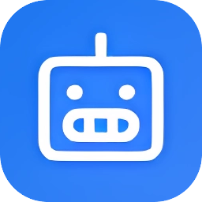

<p align="center">
  
</p>

<h1 align="center">Siliu Browser</h1>

<p align="center">
  <b>AI 驱动的浏览器自动化工具</b><br>
  用自然语言控制浏览器，让 AI 帮你完成繁琐的点击、表单填写和下载任务。
</p>

<p align="center">
  <a href="README.md">English</a> | <b>简体中文</b>
</p>

<p align="center">
  
  
  
</p>

---

## 🌟 核心功能

### 🤖 AI 智能自动化
- **自然语言控制**：用日常语言告诉浏览器该做什么
- **视觉理解**：AI 通过截图分析页面内容并决定操作
- **自我纠错**：遇到问题时自动重试并调整策略

### 🎯 精准的浏览器控制
- **基于 CDP**：使用 Chrome DevTools Protocol 实现可靠的自动化
- **拟人化行为**：随机延迟、贝塞尔曲线鼠标移动轨迹
- **坐标级操作**：在精确位置点击、输入、滚动、悬停

### 📁 文件操作
- **智能上传**：自动拦截系统文件对话框，实现无缝上传
- **下载管理**：监控并报告下载进度
- **图片保存**：使用 `saveImage` 保存图片（支持防盗链）

### 📊 数据提取
- **可视化数据采集**：从网页提取表格和列表数据
- **多格式导出**：Excel、CSV、JSON、PDF、PNG
- **分页支持**：自动跨多页抓取数据

### 🎭 Agent 系统
- **领域专属 Agent**：内置 B站、淘宝等网站的优化配置
- **自定义 Agent**：为特定网站创建专属 Agent
- **可视化标注**：Agent Editor 坐标标注工具

---

## 📦 安装

### 下载预编译版本

下载适合你平台的最新版本：

| 平台 | 下载 |
|------|------|
| Windows (安装包) | `Siliu-Setup-x.x.x.exe` |
| Windows (便携版) | `Siliu-x.x.x-Portable.exe` |
| macOS | `Siliu-x.x.x.dmg` |
| Linux | `Siliu-x.x.x.AppImage` |

### 从源码构建

```bash
# 克隆仓库
git clone https://github.com/vibeluvcommerce/siliu.git
cd siliu

# 安装依赖
npm install

# 开发模式运行
npm run dev

# 生产构建
npm run dist
```

---

## ⚙️ 配置

> 💡 **提示**：AI 配置也可以在启动应用后，在设置页面中进行配置。

在 `~/.siliu/` 目录创建 `config.json`（Windows: `%USERPROFILE%\.siliu\config.json`）：

```json
// 选项 1: Kimi Code 订阅（推荐 ⭐⭐⭐⭐）
{
  "serviceType": "cloud",
  "cloud": {
    "apiEndpoint": "https://api.kimi.com/coding/v1",
    "apiKey": "sk-your-kimi-code-api-key",
    "model": "k2p5"
  }
}

// 选项 2: Moonshot Kimi API
{
  "serviceType": "cloud",
  "cloud": {
    "apiEndpoint": "https://api.moonshot.cn/v1",
    "apiKey": "sk-your-moonshot-api-key",
    "model": "kimi-k2.5"
  }
}

// 选项 3: OpenClaw（自托管）
{
  "serviceType": "local",
  "local": {
    "url": "ws://127.0.0.1:18789",
    "token": "your-openclaw-token"
  }
}
```

### AI 后端选项

| 模式 | 配置项 | 说明 | 推荐指数 |
|------|--------|------|----------|
| **Kimi Code** | `cloud` | Kimi Code 订阅 (`api.kimi.com/coding`) | ⭐⭐⭐⭐ 推荐 |
| **Kimi API** | `cloud` | Moonshot Kimi API (`api.moonshot.cn`) | ⭐⭐⭐ |
| **OpenClaw** | `local` | 自托管 OpenClaw 网关 | ⭐⭐ |

---

## 🚀 快速开始

### 1. 启动浏览器

```bash
npm start
```

### 2. 打开 Copilot 面板

点击侧边栏的 🤖 图标打开 AI Copilot 面板。

### 3. 用自然语言下达指令

示例指令：

```
"打开 B站 并上传我的视频"
"在淘宝搜索'iPhone 15'并把第一个商品加入购物车"
"下载这个页面的第一张图片"
"提取这个列表中的所有商品价格"
```

---

## 💡 使用示例

> 📚 **更多示例**：查看 [AI_AUTOMATION_TEST.md](docs/AI_AUTOMATION_TEST.md) 获取完整的测试场景，包括 B站上传、淘宝购物、数据提取等更多示例。

### 示例 1：上传视频到 B站

```
打开 B站创作中心 https://member.bilibili.com/platform/upload/video，
点击上传按钮，选择文件 D:\videos\myvideo.mp4，
等待上传进度出现，填写标题"我的测试视频"，
选择分区"生活"，然后提交投稿。
```

**执行流程：**
1. AI 导航到上传页面
2. 点击上传按钮
3. 自动拦截并填充系统对话框
4. 等待上传进度
5. 填写表单
6. 提交视频

### 示例 2：保存网页图片

```
打开 Unsplash https://unsplash.com，找到第一张图片，
使用 saveImage 下载它，然后告诉我文件名。
```

**执行流程：**
1. AI 从截图中识别图片位置
2. 使用 `saveImage` 操作（在坐标处显示蓝色标记）
3. 自动处理下载对话框
4. 报告：`unsplash_image.jpg (282KB) 已保存到 ~/.siliu/workspace/downloads/`

### 示例 3：提取数据到 Excel

```
打开豆瓣电影 Top250 https://movie.douban.com/top250，
采集本页的电影名称和评分，
点击下一页继续采集 3 页，
导出所有数据到 Excel 并告诉我保存位置。
```

**执行流程：**
1. AI 使用 `collect` 操作提取数据
2. 自动翻页导航
3. 导出为 `douban_movies_20240402.xlsx`
4. 报告文件路径

---

## 🏗️ 架构

```
┌─────────────────────────────────────────────────────────────┐
│                        用户界面                              │
│  ┌──────────────┐  ┌──────────────┐  ┌──────────────────┐  │
│  │  BrowserView │  │ Copilot Chat │  │ Agent Editor     │  │
│  │  (网页内容)   │  │ (AI 面板)    │  │ (坐标标注工具)    │  │
│  └──────────────┘  └──────────────┘  └──────────────────┘  │
└─────────────────────────────────────────────────────────────┘
                              │
┌─────────────────────────────────────────────────────────────┐
│                      核心服务                                │
│  ┌──────────────┐  ┌──────────────┐  ┌──────────────────┐  │
│  │ WindowManager│  │ TabManager   │  │ DialogInterceptor│  │
│  │ 窗口管理     │  │ 标签页管理   │  │ 对话框拦截器     │  │
│  └──────────────┘  └──────────────┘  └──────────────────┘  │
└─────────────────────────────────────────────────────────────┘
                              │
┌─────────────────────────────────────────────────────────────┐
│                     AI 与自动化                              │
│  ┌──────────────┐  ┌──────────────┐  ┌──────────────────┐  │
│  │   Copilot    │  │   Agent      │  │ SiliuController  │  │
│  │ (AI 大脑)    │  │   系统       │  │ (CDP + JS)       │  │
│  └──────────────┘  └──────────────┘  └──────────────────┘  │
└─────────────────────────────────────────────────────────────┘
```

### 核心组件

| 组件 | 说明 |
|------|------|
| **CDPController** | Chrome DevTools Protocol 封装，实现精准的浏览器控制 |
| **Copilot** | AI 决策引擎，解析用户指令并规划操作 |
| **Agent 系统** | 为热门网站提供领域专属知识 |
| **DialogInterceptor** | 基于 Windows API 的系统对话框自动化 |
| **ExportManager** | 处理数据采集和多格式导出 |

---

## 🎭 Agent 系统

### 内置 Agent

| Agent | 用途 | 专属知识 |
|-------|------|----------|
| **General** | 通用网页自动化 | 通用浏览器控制 |
| **Bilibili** | B站自动化 | 上传、评论、悬停菜单 |
| **Taobao** | 淘宝自动化 | 搜索、筛选、购物车操作 |
| **Data** | 数据提取 | 表格解析、分页处理 |

### 创建自定义 Agent

```javascript
const { BaseAgent } = require('./src/copilot/agents/base-agent');

class MyAgent extends BaseAgent {
  constructor() {
    super({
      id: 'myagent',
      name: '我的网站 Agent',
      icon: 'shopping-cart',
      color: '#FF6B00'
    });
  }

  getDomainKnowledge() {
    return `
【我的网站专属规则】
- 搜索框：坐标 (0.39, 0.09)，先点击再输入
- 提交按钮：橙色，位于右下角
`;
  }
}

module.exports = { MyAgent };
```

---

## 🛠️ 开发

### 项目结构

```
siliu/
├── src/
│   ├── app.js                 # 主入口
│   ├── copilot/               # AI Copilot 系统
│   │   ├── window-copilot.js  # 每窗口 Copilot
│   │   ├── agents/            # Agent 系统
│   │   └── prompt-builder.js  # 提示词构建
│   ├── siliu-controller/      # 浏览器自动化
│   │   ├── cdp-controller.js  # CDP 封装
│   │   └── cdp-manager.js     # CDP 连接管理
│   ├── core/                  # 核心服务
│   │   ├── window-manager.js  # 窗口管理
│   │   ├── tab-manager.js     # 标签页管理
│   │   ├── dialog-interceptor.js # 文件对话框自动化
│   │   └── export-manager.js  # 数据导出
│   ├── services/              # AI 服务适配器
│   └── exporters/             # 导出格式处理器
├── public/                    # UI 资源
├── docs/                      # 文档
└── assets/                    # 图标和图片
```

### 可用命令

| 命令 | 说明 |
|------|------|
| `npm start` | 启动应用 |
| `npm run dev` | 开发者模式启动（启用开发工具） |
| `npm run dist` | 为所有平台构建 |
| `npm run dist:win` | 为 Windows 构建 |
| `npm run dist:mac` | 为 macOS 构建 |
| `npm run dist:linux` | 为 Linux 构建 |

---

## 🧪 测试

查看 [AI_AUTOMATION_TEST.md](docs/AI_AUTOMATION_TEST.md) 获取完整的测试场景。

快速测试命令：

```bash
# 运行核心自动化测试
npm test
```

---

## 🤝 贡献

我们欢迎贡献！详情请参阅 [Contributing Guide](CONTRIBUTING.md)。

### 开发流程

1. Fork 本仓库
2. 创建你的功能分支 (`git checkout -b feature/amazing-feature`)
3. 提交更改 (`git commit -m 'Add amazing feature'`)
4. 推送到分支 (`git push origin feature/amazing-feature`)
5. 创建 Pull Request

---

## 📄 许可证

本项目采用 MIT 许可证 - 详见 [LICENSE](LICENSE) 文件。

---

## 🙏 致谢

- 使用 [Electron](https://www.electronjs.org/) 构建
- 图标来自 [Phosphor Icons](https://phosphoricons.com/)
- 字体：[Inter](https://rsms.me/inter/)

---

<p align="center">
  用 ❤️  by Siliu Team 制作
</p>
